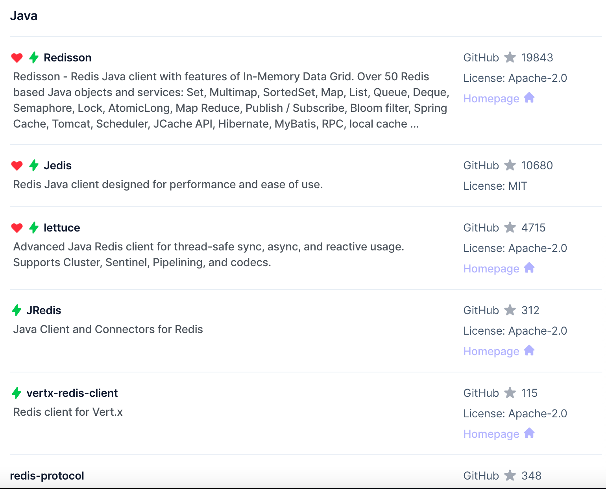

# Redis 客户端

Redis 官网中，提供了各个语言的客户端，其中 Java 的地址为：https://redis.io/resources/clients/#java

标记为 ❤ 的是 Java 推荐使用的客户端，包括
- Redisson: 在 Redis 的基础上实现了一些可伸缩的 Java 数据结构，例如 Map, Queue等，支持跨进程的同步需求。  
- Jedis 和 lettuce: 封装了对 Redis 操作的一些 API，方便我们操作 Redis，而 SpringDataRedis 又对这两种
做了抽象和封装，所以以SpringDataRedis作为学习对象。
