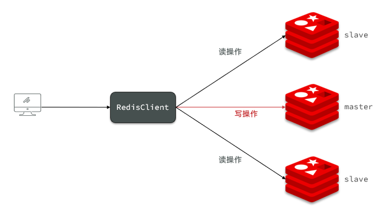

# Redis 集群方案

## 1、主从架构


准备三份不同的配置文件，启动三个 redis-server，端口为6379，6380，6381

```shell
[root@node1 redis]# ps -ef | grep redis
root        8830       1  0 01:20 ?        00:00:04 redis-server 0.0.0.0:6379
root        8836       1  0 01:20 ?        00:00:04 redis-server 0.0.0.0:6380
root        8843       1  0 01:20 ?        00:00:04 redis-server 0.0.0.0:6381
root        8900    7706  0 01:52 pts/1    00:00:00 grep --color=auto redis
```
**开启主从关系**

有永久生效和临时生效两种方式

- 永久生效:
在配置文件中 replicaof 或者 slaveof（5.0 以前）命令。在 redis.conf 中添加一行配置：
```sh
slaveof <masterip> <masterport>
```
- 命令行方式
```shell
# 连接 7002
redis-cli -p 7002
# 执行slaveof/replicaof
slaveof 192.168.150.101 7001
```

**查看节点状态**
```
127.0.0.1:6379> info replication
# Replication
role:master
connected_slaves:2
slave0:ip=10.211.55.3,port=6380,state=online,offset=266,lag=1
slave1:ip=10.211.55.3,port=6381,state=online,offset=266,lag=1
master_replid:bdf67ac130e47d65a72ceb61240978c5854357a2
master_replid2:0000000000000000000000000000000000000000
master_repl_offset:266
second_repl_offset:-1
repl_backlog_active:1
repl_backlog_size:1048576
repl_backlog_first_byte_offset:1
repl_backlog_histlen:266
```
只有主节点可以进行写操作，其他节点只能进行读操作
