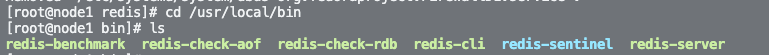

## 1、CentOS 安装 redis

### 1.1 安装Redis依赖

Redis是基于C语言编写的，因此首先需要安装Redis所需要的gcc依赖：

```sh
yum install -y gcc tcl
```


### 1.2 下载压缩包并解压

```
wget http://download.redis.io/releases/redis-6.0.8.tar.gz
```

```
tar xzf redis-6.0.8.tar.gz
```

### 1.3 编译

```
cd redis-6.0.8
make && make install
```
默认的安装路径是在 `/usr/local/bin`目录下，该目录会默认配置环境变量。


此时可以执行启动脚本，如下：
- redis-cli: redis 的命令行客户端
- redis-server: redis 的服务端启动脚本
- redis-sentinel:  redis 的哨兵启动脚本

## 2、启动 Redis

### 2.1 快速启动

在任意位置执行 `redis-server`命令，可快速前台启动 Redis。

### 2.2 指定配置文件启动

在任意位置执行 `redis-server redis.conf `命令，可指定配置文件启动 Redis。

常用配置

```
# 绑定地址，默认为127.0.0.1 只能在本机访问，0.0.0.0 可以在任意IP访问
bind 0.0.0.0

# 指定监听端口，默认为 6379。
# 如果指定了端口 0，则代表 Redis 不监听任何 TCP 协议。
port 6379

# 守护进程，是否后台启动
daemonize yes

# TCP keepalive.
# 客户端心跳检测间隔时间，默认为 300 秒。
tcp-keepalive 300

# redis实例的声明 IP
replica-announce-ip 192.168.150.101

# dump 的数据库存放点
dbfilename dump.rdb

# 数据库存放目录
dir ./

# 指定日志文件，如果已后台方式运行但日志文件为空的话，日志会被丢弃。
logfile ""

# 设置数据库数量。
databases 16

# requirepass配置可以让用户使用AUTH命令来认证密码
requirepass foobared

# 把危险的命令给修改成其他名称。比如CONFIG命令可以重命名为一个很难被猜到的命令，这样用户不能使用，而
# 内部工具还能接着使用:
# 例如：
# rename-command CONFIG b840fc02d524045429941cc15f59e41cb7be6c52
 
# 设置成一个空的值，可以禁止一个命令
# rename-command CONFIG ""

```

## 3、 连接 Redis

### 3.1 使用 redis-cli 连接

```sh
redis-cli [options] [commands]
```

常用参数:

- `-h 127.0.0.1`：指定要连接的redis节点的IP地址，默认是127.0.0.1
- `-p 6379`：指定要连接的redis节点的端口，默认是6379
- `-a 123321`：指定redis的访问密码 

commands 就是 Redis 的操作命令。不指定时，会进入交互控制台
```sh
[root@node1 redis]# redis-cli ping
PONG
```

停止服务：

```sh
# 利用redis-cli来执行 shutdown 命令，即可停止 Redis 服务，
# 因为之前配置了密码，因此需要通过 -u 来指定密码
redis-cli -u 123321 shutdown
```


